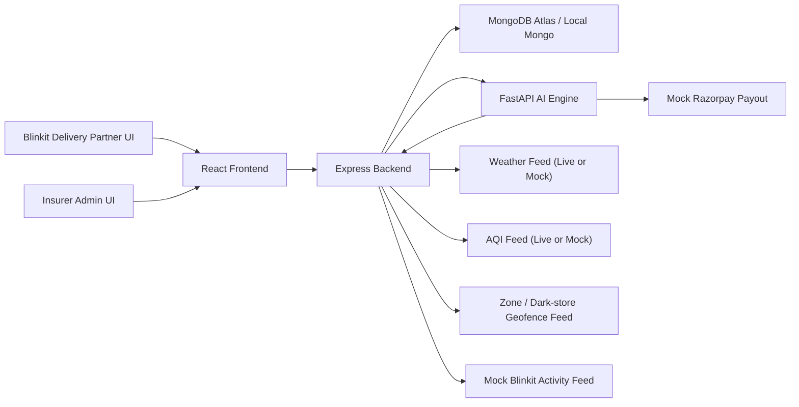

# BlinkShield AI

Fraud-Resistant Smart Insurance for Blinkit Delivery Partners

BlinkShield AI is a hackathon-ready parametric insurance platform built specifically for Blinkit-style quick-commerce delivery partners. It protects only against loss of income caused by external disruptions such as heavy rainfall, extreme heat, severe pollution, dark-store closures, zone restrictions, and locality-level platform outages.

The product is intentionally Blinkit-specific:

- hyperlocal dark-store based risk
- short delivery radius assumptions
- peak-hour disruption windows
- weekly pricing aligned to gig payouts
- zero-touch parametric claims
- fraud resistance for GPS spoofing and fake activity patterns

## Problem Statement

Blinkit delivery partners can lose 20-30% of weekly earnings when disruption events reduce their active delivery windows. Traditional insurance is too slow, too manual, and too generic for hyperlocal quick-commerce operations. BlinkShield AI automates weekly income protection using deterministic AI agents, explainable pricing, and mock-safe demo integrations.

## Solution Overview

BlinkShield AI has three apps:

- `frontend`: React + Tailwind worker and admin dashboards
- `backend`: Express API gateway with MongoDB models, policy logic, seeded demo data, and AI orchestration
- `ai-engine`: FastAPI service with deterministic agents and Isolation Forest fraud detection

## Architecture



## Agent Design

### 1. Disruption Monitoring Agent

Evaluates heavy rain, heat, AQI, zone restriction, and platform outage triggers. Outputs disruption type, severity, trigger status, evidence, and recommended claim window.

### 2. Risk Assessment Agent

Produces explainable weekly premium and income coverage using:

- zone risk score
- forecast severity
- disruption frequency
- pollution history
- flood-prone factor
- worker activity consistency

### 3. Fraud Detection Agent

Uses an Isolation Forest model plus deterministic fallback rules to detect:

- GPS spoofing
- static device behavior
- impossible route transitions
- no delivery activity during the claim window
- abnormal claim frequency
- coordinated multi-user anomalies

### 4. Claim Decision Agent

Approves, flags, or rejects claims using:

- active policy state
- trigger validity
- worker zone eligibility
- fraud score
- estimated income loss

### 5. Payout Execution Agent

Simulates payout execution and returns a mock payout reference for the demo flow.

## Parametric Triggers

| Trigger | Threshold | Source | Claim Window | Evidence Stored |
| --- | --- | --- | --- | --- |
| Heavy Rainfall | Rainfall > 50 mm | OpenWeather or mock weather | 3 hours | rainfall reading, zone, source payload |
| Extreme Heat | Temperature > 42 C | OpenWeather or mock weather | 2 hours | temperature reading, zone, source payload |
| Severe Pollution | AQI > 300 | AQI API or mock AQI feed | 2 hours | AQI reading, zone, source payload |
| Zone Restriction / Dark-store Closure | geofence restricted or store closed | mock geofence / maps proxy | 4 hours | zone restricted flags |
| Platform Outage / Order Suspension | locality order suspension | mock Blinkit activity feed | 3 hours | platform outage flags |

All triggers support:

- live API mode through env wiring
- mock mode for local demos and hackathon recordings

## Weekly Pricing Model

Baseline weekly tiers:

- Low risk: `₹20 premium / ₹200 coverage`
- Medium risk: `₹40 premium / ₹400 coverage`
- High risk: `₹60 premium / ₹600 coverage`

Dynamic adjustments are applied on top of the base tier:

- monsoon disruption history
- pollution volatility
- worker activity regularity
- flood-prone micro-zone factor
- next-week weather severity
- safe-zone discount where applicable

Example explanation returned by the product:

> Base premium ₹40. Reduced by ₹2 due to historically safe zone pockets. Increased by ₹4 due to monsoon disruption history. Final weekly premium ₹46 for ₹440 income cover.

## Fraud Detection Design

Main model:

- `IsolationForest` trained on synthetic delivery telemetry

Key features:

- `gps_stability_score`
- `movement_distance_ratio`
- `avg_speed`
- `accelerometer_motion_score`
- `delivery_completion_rate`
- `claim_frequency_30d`
- `network_geo_consistency`
- `cross_worker_trigger_similarity`
- `active_minutes_during_window`

UX principle:

- suspicious claims are flagged for verification
- only clearly fraudulent claims are rejected

## Monorepo Structure

```text
blinkshield-ai/
├── frontend/
│   ├── src/
│   │   ├── api/
│   │   ├── components/
│   │   ├── context/
│   │   ├── hooks/
│   │   ├── pages/
│   │   └── utils/
│   ├── Dockerfile
│   ├── package.json
│   └── .env.example
├── backend/
│   ├── src/
│   │   ├── config/
│   │   ├── controllers/
│   │   ├── data/
│   │   ├── middleware/
│   │   ├── models/
│   │   ├── routes/
│   │   ├── scripts/
│   │   ├── services/
│   │   ├── utils/
│   │   └── validators/
│   ├── tests/
│   ├── Dockerfile
│   ├── package.json
│   └── .env.example
├── ai-engine/
│   ├── app/
│   │   ├── agents/
│   │   ├── core/
│   │   ├── models/
│   │   ├── orchestrator/
│   │   ├── services/
│   │   └── tests/
│   ├── scripts/
│   ├── data/
│   ├── models/
│   ├── Dockerfile
│   ├── requirements.txt
│   └── .env.example
├── docs/
├── assets/
├── docker-compose.yml
└── README.md
```

## Setup

### Prerequisites

- Node.js 22+
- Python 3.13+
- MongoDB Atlas connection string or local Mongo via Docker

### 1. Create the Python virtual environment

From the repo root:

```powershell
py -m venv .venv
.\.venv\Scripts\Activate.ps1
python -m pip install --upgrade pip
pip install -r ai-engine\requirements.txt
```

### 2. Configure environment files

Copy:

- `backend/.env.example` to `backend/.env`
- `frontend/.env.example` to `frontend/.env`
- `ai-engine/.env.example` to `ai-engine/.env`

### 3. Install frontend and backend dependencies

```powershell
cd backend
npm install
cd ..\frontend
npm install
cd ..
```

### 4. Train the fraud model

```powershell
.\.venv\Scripts\python.exe ai-engine\scripts\train_fraud_model.py
```

### 5. Seed the database

```powershell
cd backend
npm run seed
cd ..
```

### 6. Run the stack locally

Terminal 1:

```powershell
cd ai-engine
..\.venv\Scripts\python.exe -m uvicorn main:app --reload --port 8000
```

Terminal 2:

```powershell
cd backend
npm run dev
```

Terminal 3:

```powershell
cd frontend
npm run dev
```

Open [http://localhost:5173](http://localhost:5173)

### Docker Compose

```powershell
docker compose up --build
```

## Seeded Demo Accounts

- Worker: `asha@blinkshield.demo / Pass@123`
- Worker: `rohan@blinkshield.demo / Pass@123`
- Worker: `imran@blinkshield.demo / Pass@123`
- Admin: `admin@blinkshield.demo / Admin@123`

## Demo Script

### Quick 2-minute flow

1. Log in as the worker.
2. Show weekly policy, quote explainability, and live monitor.
3. Log in as admin.
4. Simulate heavy rainfall in Koramangala.
5. Return to worker claims and payouts to show zero-touch automation.

### Extended 5-minute flow

1. Show onboarding and worker profile.
2. Explain weekly premium factors.
3. Simulate severe pollution or zone restriction.
4. Show admin analytics and loss ratio.
5. Simulate GPS spoof attack and open the fraud alerts page.

## UI Pages Included

Worker:

- Landing page
- Register / Login
- Onboarding
- Premium quote page
- Policy dashboard
- Live disruption monitor
- Claims page
- Payout history

Admin:

- Admin dashboard
- Fraud alerts page
- Demo simulator controls

## API Summary

See [docs/API_REFERENCE.md](docs/API_REFERENCE.md) and [docs/POSTMAN_COLLECTION.json](docs/POSTMAN_COLLECTION.json).

## Screenshot Placeholders

Add final screenshots under [assets/README.md](assets/README.md):

- landing page
- worker dashboard
- admin overview
- fraud alerts

## Deployment Targets

- Frontend: Vercel
- Backend: Render
- AI Engine: Render

The repo is also runnable locally with Docker Compose for judge demos.

## Hackathon Alignment

BlinkShield AI visibly satisfies the expected Phase 2 criteria:

- registration process
- insurance policy management
- dynamic weekly premium calculation
- claims management
- five automated disruption triggers
- zero-touch claim and payout flow

## Future Scope

- Real live weather, AQI, and geofence APIs
- WhatsApp / Hindi claim notifications
- Real Razorpay test payout integration
- Cross-platform expansion to Zepto, Swiggy Instamart, and other quick-commerce fleets
- Better cohort-wide anomaly detection across dark stores
